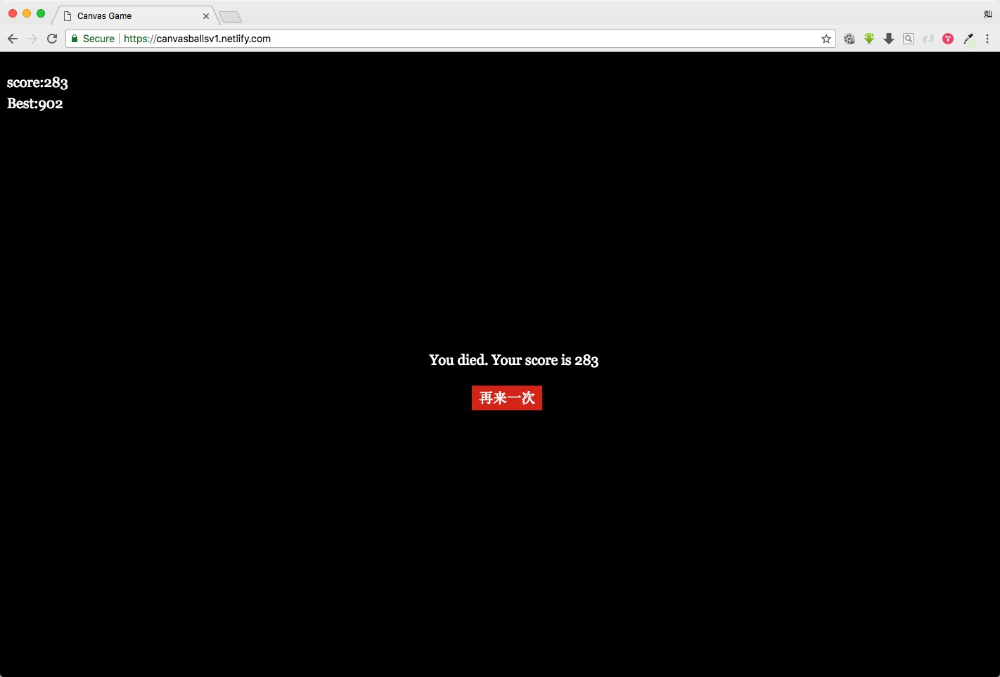
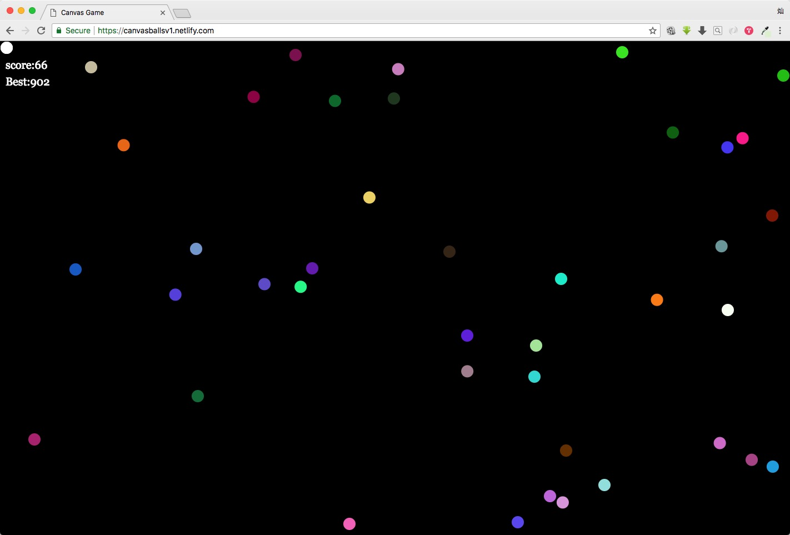

这里是我写过的一些有趣的, 有用的demos

### 1. 计算器(JavaScript)

##### V1

只实现最简单的加减乘除, Delete和AC. 样式也比较基本.效果图如下:

##### V2

### 2. 登录验证

JS文件中包含了一些常用的表单验证.

### 3.TodoAPP

用Vue写的TodoAPP, 用webpack打包代码.

目前还有两个bug没有解决.

### 4.canvasGame

在canvas上随机生成运动的球, 根据躲避的时间计分数. 比较关键的代码: 碰撞检测. 还用到了localStorage存储分数.

